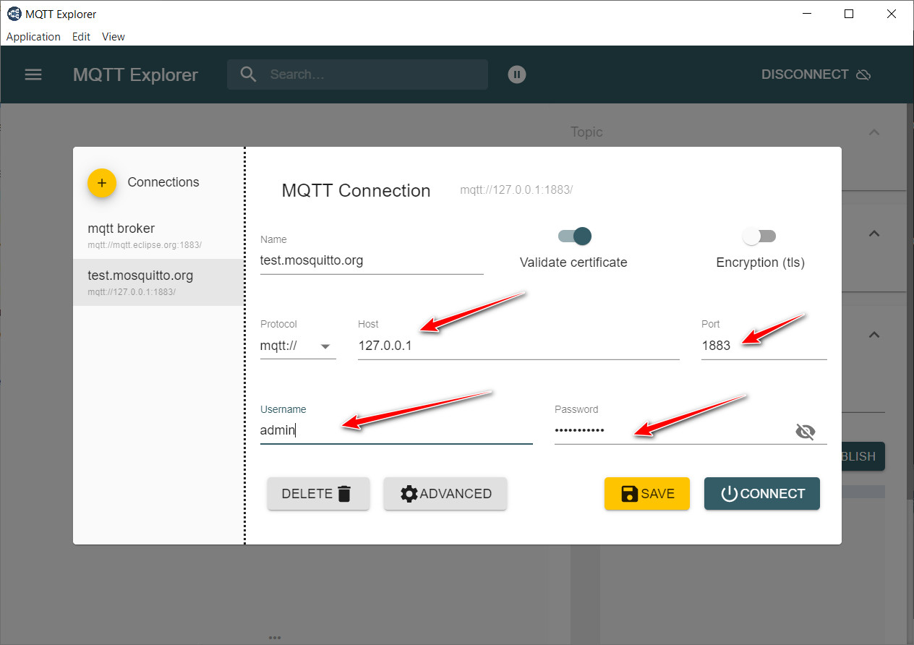
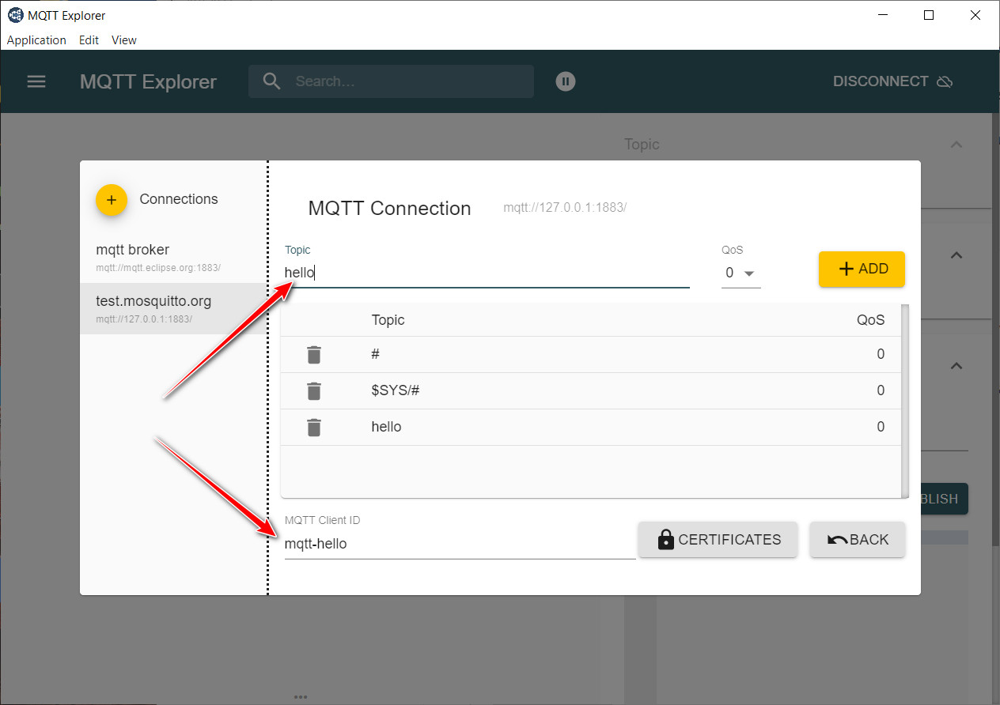
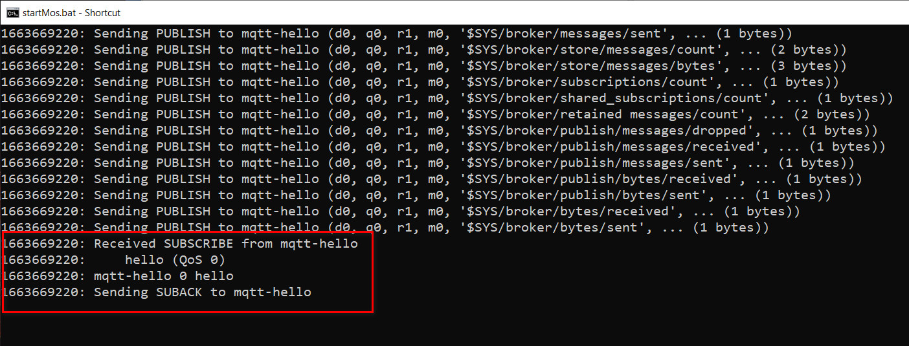
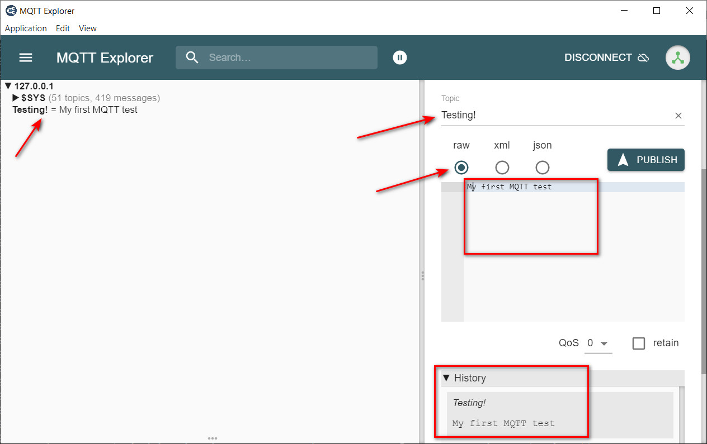
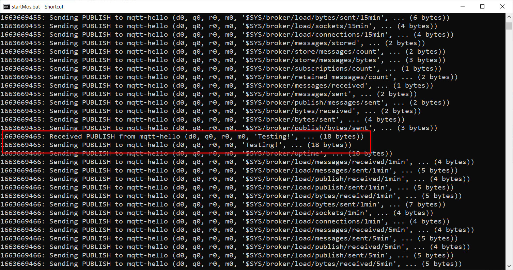

# Start MQTT Broker - Mosquitto

## Basics of MQTT

MQTT (MQ Telemetry Transport) is a lightweight open messaging protocol that provides resource-constrained network clients with a simple way to distribute telemetry information in low-bandwidth environments. 

**Example:**

MQTT broker has a similar functions with Instagram Application. If a user follows (subscribes) a person, the user can get a notification of the new posts in real time, but if the person doesn't follow (subscribes) the user, on the contrary, the person can not get the notification of the new posts from the user in real time. If both part follow (subscribe) each other, both can get the notification of the new posts from others. That is a basic example for MQTT work.

## Terminology

- **Broker**

  Basically, MQTT Broker is a central server to which MQTT client connect for managing and resend the topics with payload to the subscriber(client) and publisher (client)

- **Topics**

  MQTT Messages are arranged in a hierarchy of topics that are addressed as UTF-8 strings. Levels in the topic hierarchy are separated by forward slash characters ('/') similar to how files are arranged on your local disk. Topic strings (paths) are used to access MQTT messages in the same way file paths are used to access files. 

  Valid examples include:

  ```
  "my_house/family_room/temperature" and "my_house/kitchen/temperature".
  ```

- **Payload**

  Payload is the body of each MQTT message.

- **Publish**

  When a client publishes to a topic on the MQTT broker, it is updating the data associated with that topic on the broker, and publishing new messages for the topic’s subscribers (if any). There is no limit to the number of clients that can publish to a topic. A message can only be published to one topic at a time.

- **Subscribe**

  Once a client subscribes to a topic on the MQTT broker, it will receive all of the subsequent messages that have been published to the topic.  There is no limit to the number of clients that can subscribe to a topic. Clients can subscribe to either a specific topic such as “my_house/kitchen/temperature” or to a range of topics.

- **Topic Filters**

  It is used by the client to define its subscription to topic(s). A subscription’s topic filter can contain wild cards to subscribe to multiple topics. 

- **Topic Wildcards**

  Topic Wildcards enable a single subscription to receive updates from multiple topics. 

  The multi-level (‘#’) wildcard is used to specify all remaining levels of hierarchies and **must be the last character** in the topic subscription string. 

  - If the client subscribes to `my_house/#`, then the client will receive the messages published to `my_house/family_room` and `my_house/kitchen`. 
  - If the client subscribes to `my_house/family_room/#`, then the client will receive the messages published to `my_house/family_room/temperature` and `my_house/family_room/humidity`. However, it would not receive any messages published to `my_house/kitchen`. 

  The single level (‘+’) wildcard is used to match one topic level of hierarchy. The single (‘+’) wildcard can be used more than once in the topic filter and in conjunction with the multi-level wildcard. 

  - If the client subscribes to `my_house/+/temperature`, then the client will receive the messages published to both `my_house/family_room/temperature` and `my_house/kitchen/temperature`.
  - If the client subscribes to `my_house/+/temperature/#`, then the client will receive the messages published to both `my_house/family_room/temperature/sensor_1` and `my_house/kitchen/temperature/sensor_2`. 

- **Quality of Service (QoS)**

  Quality of Service ([QoS](https://www.hivemq.com/blog/mqtt-essentials-part-6-mqtt-quality-of-service-levels/)) refers to the reliability of message delivery between the publisher and subscriber. MQTT defines three quality of service levels.

  - QoS0 is the lowest reliability level and is defined as "at most once" delivery. QoS0 messages are the fastest to send but do not guarantee delivery. This is analogous to an UDP packet on an IP network – the UDP/IP protocol does not guarantee that UDP packets will reach their intended destination.
    - Is recommended when message queueing is not required.
    - When message loss is acceptable.
    - High frequent messages.
    - When bandwidth is at premium.
  - QoS1 is defined as "at least once" delivery. QoS1 messages are guaranteed to be delivered (if delivery is feasible), but may get delivered multiple times (duplicated).
    - Is the default level. If you don't know what you need.
    - Best tradeoff between bandwidth / delivery guarantee.
  - QoS2 is the highest reliability level and is defined as "exactly once" delivery. QoS2 messages are guaranteed to be delivered (if delivery is feasible) and guaranteed not to be duplicated. QoS2 is the safest but the slowest quality of service level.
    - When lower performance is acceptable and bandwidth is sufficient.
    - When delivery exactly once is required.

- **Persistent Session**

  - Is enabled by setting `clearSession: false` flag in the connect packet.
  - Is remembered by the broker.
    - Session data (f.e. client ID).
    - Subscriptions.
    - Unacknowledged QoS messages.
      - The mqtt message flow can be resumed a later point of time.
    - Queued messages.
      - The broker queues for an mqtt client that is offline, the client will received after reconnection.
  - Can continue the state as soon as a reconnect as a mqtt client.
  - **Persistent Session is recommended when**
    - Subscribers must not miss messages.
    - Lot of subscription information, want the broker to store.

- **Clean Session**

  - All stored client information is deleted as soon as the client disconnects.
  - **Clean Session is recommended when**
    - A client only needs to publish, like temperature sensor.
    - Message loss is acceptable.

- **Queued messages**

  - Work on a client level.
  - Only for the presistent seission client.
  - Broker queues all QoS1 and QoS2 undelivered messages for a specific client, when the client is offline.
  - QoS0 messages are never queued.

- **Retained message**

  Is a topices last known good value persisted by the broker. This means the last message which was sent by any client on a specific topic can be persisted on a broker, so new subscribers subscribing to this topic would get the most the freshest value available on the broker. They don't need to start with an empty value.

  - Work on a topic level.
  - Are useful when a start sate is required.
  - Ensure that client or newly-connected subscribers get the last stored value immediately after subscription.(even if they were offline when the message was published).
  - Setting by the PUBLISH packet `retainFlag: true`
  - Only one retained message per topic is stored by the broker.

- **Last Will & Testament(LWT)**

  Is a notification to other clients when a client disconnects ungracefully (not send the disconnect packet to the broker)

  - `lastWillTopic` : Is the topic of mqtt message the broker should send on behalf of the client, if sender dies.
  - `lastWillMessage` : The actual content of the message.
  - `lastWillQoS` : The quality service level of the message, 0, 1, 2.
  - `lastWillRetain` : Set the retained flag for disconnect packet.
  - The broker sends the LWT message when : 
    - The broker detects on I/O error or network failure.
    - The client fails to communicate within the defined Keep Alive Period.
    - The client does not send a Disconnect packet before it closes the network connection. 
    - The broker closes the network connection because of a protocol error.

- **Keep Alive**

  - This mechanism ensures that the connection between client and broker is open, and both are ware of being connected.

- **Client Takeover**

  - If there is two connection from a same Client ID to the broker, broker will discount old one and keep connection with the new one.
    - Use unique ClientId

---


## Install MQTT Broker - Mosquitto

### Windows:

- Download the installer from [mosquitto.org](https://mosquitto.org/download/)

- **NSIS Error** - error launching installer

  Solution: [Fix NSIS Error](https://appuals.com/nsis-error-error-launching-installer/)

  - Change location of the downloaded installer on the computer
  - Rename downloaded installer file name 

  Reason: 

  - Probably because of new computer region or time settings.

### Ubuntu:

- Using PPA way to install the Mosquitto

- PPA way for installing the package:

  - A Personal Package Archive (PPA) is a repository of software that isn't included in the default Linux operating system installation.
  - PPA way installation will add the PPA repository to the `sources.list` folder, which will keep software up to date and download regular updates faster with `sudo apt-get update` than using merely the Ubuntu software center. 

- Installation steps of using PPA way:

  ```bash
  sudo apt-add-repository ppa:mosquitto-dev/mosquitto-ppa
  sudo apt-get update
  sudo apt-get install mosquitto
  sudo apt-get install mosquitto-clients
  ```

- The following command helps to clean out the cache once you have installed the packages using the apt-get install command in your system. It removes the files that are no longer required but are still residing on your system and keeps the system space. Removes the retrieved .deb installer files and clears out the `/var/cache/apt/archive` leaving only the files in the lock and the partial directory.

  ```bash
  sudo apt-get clean
  
  sudo ls /var/cache/apt/archives/
  lock  partial
  ```

- **`command not found` Error**

  Solution:

  - Using following commend for checking `software-properties-common` whether or not installed on the ubuntu.

    ```bash
    apt policy software-properties-common
    ```

  - If not, install the `software-properties-common`

    ````bash
    apt-get install software-properties-common
    ````

  Reason: 

  - `apt-add-repository` using `software-properties-common` tool for adding the repository.

---


## Configuration - mosquitto.conf

- Find and edit the `mosquitto.conf` file from installation place.
- **Recommend Tools:**
  - Notepad++
  - vim
  - nano

- The Following steps are for the **Windows** user. For the **Ubuntu** user, the following commands can be directly added into `mosquitto.conf ` file, which is located at `etc/mosquitto/`. Besides, `Ctrl + h` showing hidden files.

### listener

- At line 231 in mosquitto.conf file

  ````
  # listener port-number [ip address/host name/unix socket path]
  listener 1883
  #listener
  ````

### allow_anonymous

- false: allows connection with password

- true: allows connections without password

- At line 534 in mosquitto.conf file

  ````
  #allow_anonymous false
  allow_anonymous true
  ````

### password_file (option)

- If `allow_anonymous true` , no need to set this step.

- Connect the password_file to mosquitto.conf file

- At line 552 in mosquitto.conf file

  ```
  # password_file, the plugin check will be made first.
  password_file pwfile.example
  ```


### username & password (option)

- If `allow_anonymous true` , no need to set this step.

- Run Windows PowerShell as **administrator**, otherwise haven't the right to change password.

- Get into the folder where the mosquitto installed.

- Implement bind pwfile.example to mosquitto, set the username: admin.

  ````
  PS D:\mosquitto> .\mosquitto_passwd.exe -c .\pwfile.example admin
  Password:
  Reenter password:
  ````

- Password: kenttaviiva

---


## Run MQTT Broker (local)

- run commend `\mosquitto -c .\mosquitto.conf -v` for starting the Broker

  ```
  D:\mosquitto>.\mosquitto -c .\mosquitto.conf -v
  1663660085: mosquitto version 2.0.15 starting
  1663660085: Config loaded from .\mosquitto.conf.
  1663660085: Starting in local only mode. Connections will only be possible from clients running on this machine.
  1663660085: Create a configuration file which defines a listener to allow remote access.
  1663660085: For more details see https://mosquitto.org/documentation/authentication-methods/
  1663660085: Opening ipv4 listen socket on port 1883.
  1663660085: Opening ipv6 listen socket on port 1883.
  1663660085: mosquitto version 2.0.15 running
  ```

### Create a batch file (.bat)

- Creating a batch file is a fast way to start the MQTT Broker. No need every time to input a long commend `\mosquitto -c .\mosquitto.conf -v` .
- Open NotePad++, input `\mosquitto -c .\mosquitto.conf -v` and save as a batch file at the mosquitto installation folder.
- Just click the batch file for starting the MQTT Broker.

---


## Show mosquitto status

- Check the mosquitto status.

  ```bash
  systemctl status mosquitto.service
  ```

- Check mosquitto connection status.

  ```bash
  sudo lsof -i | grep mosquitto
  ```

- Restart mosquitto.

  ```bash
  sudo systemctl restart mosquitto
  ```

---


# Start MQTT Explorer

- Download [MQTT Explorer](https://mqtt-explorer.com/)

## Set MQTT Connection

- **Ubuntu**

  - Check and confirm the using port of mosquitto.

    ```bash
    netstat -tulpn
    ```

  - Check the host address.

    ```bash
    ifconfig
    ```

- Input the host address and port number.

  -  example: localhost address 127.0.0.1 and port as 1883.

- Set username, password (option)

  

- Set advanced

  - Publish a topic to the Broker.
  - Naming a client.

  

## MQTT Connecting & Testing

- Connection succeeds.

  

- Publish a topic to Broker.

  

- Check the Broker status.

  

- Testing succeeds.

---

